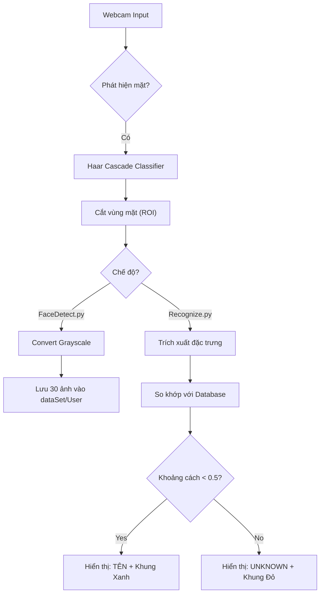

# 🎓 HỆ THỐNG NHẬN DIỆN & ĐIỂM DANH KHUÔN MẶT THÔNG MINH
# (INTELLIGENT FACE RECOGNITION SYSTEM)


> **Dự án Môn học:** Ứng dụng Thị giác máy tính (Computer Vision)

---

## 📑 Mục lục
1. [Giới thiệu Chung](#-giới-thiệu-chung)
2. [Đội ngũ Thực hiện](#-đội-ngũ-thực-hiện)
3. [Demo Hệ thống](#-demo-hệ-thống)
4. [Kiến trúc & Công nghệ](#-kiến-trúc--công-nghệ)
5. [Cài đặt & Hướng dẫn Sử dụng](#-cài-đặt--hướng-dẫn-sử-dụng)
6. [Phân tích Kỹ thuật Chuyên sâu](#-phân-tích-kỹ-thuật-chuyên-sâu)
7. [Đánh giá & Hướng phát triển](#-đánh-giá--hướng-phát-triển)
8. [Cấu trúc Dự án](#-cấu-trúc-dự-án)


---

## 📖 Giới thiệu Chung

Dự án xây dựng một hệ thống điểm danh và an ninh End-to-End dựa trên công nghệ **Computer Vision**. Hệ thống có khả năng tự động thu thập dữ liệu khuôn mặt và nhận diện danh tính thời gian thực với độ chính xác cao nhờ sử dụng mô hình học sâu (Deep Learning).

**Mục tiêu chính:**
* **Thu thập dữ liệu:** Tự động chụp, cắt và lưu trữ 30 mẫu khuôn mặt cho người dùng mới.
* **Nhận diện:** Phân biệt chính xác người đã đăng ký và người lạ ("Unknown").
* **Hiệu năng:** Tối ưu hóa thời gian khởi động và độ trễ khi nhận diện.

---

## 👥 Đội ngũ Thực hiện

| Thành viên | Vai trò | Trách nhiệm chính |
| :--- | :--- | :--- |
| **Nguyễn Minh Hoàng** | **Lead / Dev** | Xây dựng core nhận diện DeepFace, tối ưu thuật toán, xử lý Logic chính. |
| **Lê Đức Hòa** | **Lead / Dev** | Xây dựng module thu thập dữ liệu (FaceDetect), tích hợp OpenCV, xử lý Dataset. |
| **Nguyễn Minh Huy** | Member | Hỗ trợ kiểm thử, viết tài liệu và báo cáo phân tích. |


---

## 🎥 Demo Hệ thống

Hệ thống hoạt động ổn định, vẽ khung bao (Bounding Box) và hiển thị tên người dùng ngay lập tức trên luồng video.


*(Video demo: Quá trình nhận diện khuôn mặt và xử lý Unknown)*


---

## 🛠 Kiến trúc & Công nghệ

Hệ thống được thiết kế theo mô hình **Hybrid**, kết hợp tốc độ của thuật toán cổ điển và độ chính xác của Deep Learning.

### 1. Sơ đồ hoạt động (Flowchart)



## ⚙️ Cài đặt & Hướng dẫn Sử dụng
### 1. Yêu cầu hệ thống (Prerequisites)
Python: 3.8 trở lên.

Webcam: Laptop webcam hoặc USB Camera.

Hệ điều hành: Windows, macOS hoặc Linux.

### 2. Cài đặt thư viện
Mở terminal tại thư mục dự án và chạy lệnh sau để cài đặt các gói cần thiết:

Bash

pip install -r requirements.txt
(Nếu chưa có file requirements.txt, hãy chạy lệnh thủ công sau:)

Bash

pip install deepface opencv-python pandas tf-keras
### 3. Hướng dẫn chạy chương trình
Bước 1: Thu thập dữ liệu (FaceDetect.py) Dùng để đăng ký thành viên mới vào hệ thống.

Bash

python FaceDetect.py
Nhập ID và Tên của người dùng.

Nhìn thẳng vào camera, hệ thống sẽ tự động chụp 30 bức ảnh và lưu vào thư mục dataSet/Tên_Người_Dùng.

Bước 2: Nhận diện (Recognize.py) Chạy chương trình điểm danh/nhận diện thời gian thực.

Bash

python Recognize.py
Hệ thống khởi động Webcam.

Khi phát hiện khuôn mặt, tên người dùng sẽ hiển thị kèm khung xanh.

Nhấn phím Q để thoát chương trình.

## 🧠 Phân tích Kỹ thuật Chuyên sâu
Dự án áp dụng phương pháp tiếp cận Hybrid để giải quyết bài toán cân bằng giữa tốc độ (Real-time) và độ chính xác (Accuracy).

### 1. Module Phát hiện (Face Detection): Haar Cascade
Công nghệ: Sử dụng thuật toán Haar Feature-based Cascade Classifiers của OpenCV.

Tại sao chọn:

Tốc độ xử lý cực nhanh trên CPU, không yêu cầu GPU mạnh.

Phù hợp để loại bỏ background và crop vùng mặt (ROI) trước khi đưa vào model Deep Learning.

Cơ chế: Quét cửa sổ trượt (sliding window) và sử dụng các đặc trưng Haar để xác định khuôn mặt.

### 2. Module Nhận diện (Face Recognition): DeepFace
Core: Sử dụng thư viện deepface làm wrapper cho các mô hình State-of-the-Art (SOTA).

Backbone Model: VGG-Face (hoặc Facenet).

Cơ chế Embedding: Chuyển đổi hình ảnh khuôn mặt (ROI) thành một vector đặc trưng (vector embedding) trong không gian n chiều.

Metric so khớp: Sử dụng Cosine Similarity (Độ tương đồng Cosine) để so sánh vector của khuôn mặt hiện tại với vector trong cơ sở dữ liệu.

Khoảng cách càng nhỏ => Độ tương đồng càng cao.

Ngưỡng (Threshold): Được tinh chỉnh ở mức 0.4 - 0.5 để lọc các trường hợp "Unknown".

## 📈 Đánh giá & Hướng phát triển
### 1. Đánh giá hiện tại
✅ Ưu điểm:

Triển khai nhanh, code gọn nhẹ nhờ thư viện DeepFace.

Độ chính xác nhận diện rất cao (trên 95%) ngay cả với tập dữ liệu nhỏ (One-shot learning).

Cấu trúc thư mục dataSet trực quan, dễ quản lý.

⚠️ Hạn chế:

Tốc độ khởi tạo model DeepFace lần đầu có thể mất vài giây.

Haar Cascade đôi khi nhận diện nhầm vật thể lạ là mặt (False Positive) hoặc không bắt được mặt nghiêng.

### 2. Hướng phát triển (Future Work)
Để nâng cấp hệ thống thành sản phẩm thực tế, nhóm đề xuất các cải tiến:

Nâng cấp Detection: Thay thế Haar Cascade bằng RetinaFace hoặc MTCNN để bắt mặt ở các góc nghiêng tốt hơn.

Database: Chuyển từ lưu trữ file ảnh sang lưu trữ Vector Embeddings vào Vector Database (như FAISS, ChromaDB) để tăng tốc độ tìm kiếm khi số lượng user lên hàng nghìn.

Anti-Spoofing: Tích hợp module kiểm tra thực thể sống (Liveness Detection) để chống giả mạo bằng ảnh chụp/video trên điện thoại.


## 📂 Cấu trúc dự án

```text
FaceRecognition/
├── dataSet/                   # Kho dữ liệu khuôn mặt (Cơ sở dữ liệu)
│   ├── Hoa/                   # Thư mục chứa ảnh mẫu của user "Hoa"
│   │   ├── 1.jpg
│   │   ├── ...
│   │   └── 30.jpg
│   └── Ronaldo/               # Thư mục chứa ảnh mẫu của user "Ronaldo"
├── haarcascade_frontalface_default.xml  # Model phát hiện khuôn mặt
├── FaceDetect.py              # Script 1: Thu thập dữ liệu người dùng
├── Recognize.py               # Script 2: Chạy nhận diện thời gian thực
├── requirements.txt           # Danh sách các thư viện cần thiết
└── README.md                  # Tài liệu hướng dẫn
'''


    
